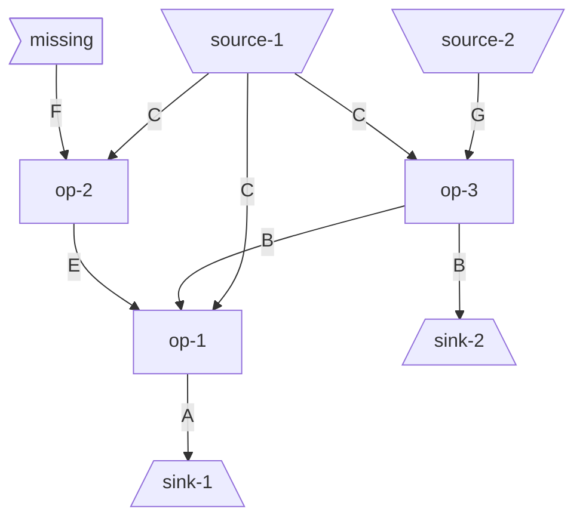
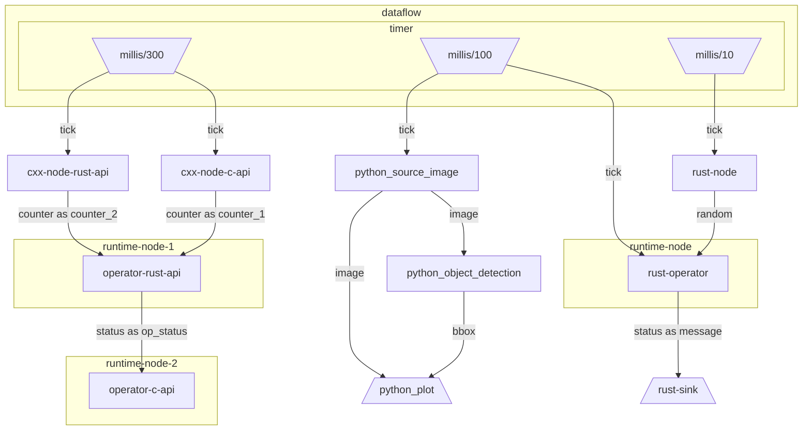
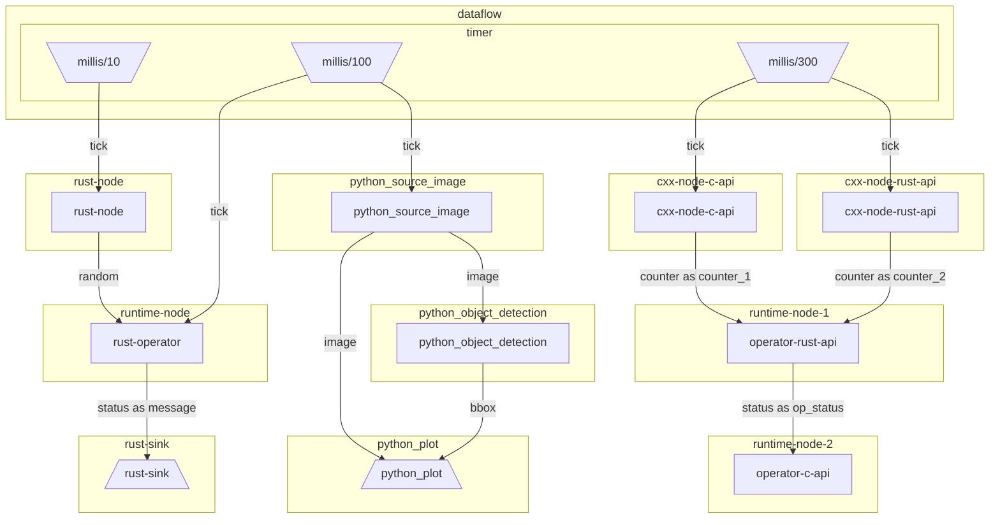

# dataflow-rs
a repo of a multi-language dataflow implementation ,The way to build web3，rtos，mq or dataflow.


## ch1: 
### dataflow 第一版架构设计


### 首先我们在ch1中先简单写一个dataflow yaml定义的描述文件

最终目标是通过yaml文件生成一个dataflow的图，然后通过图生成一个dataflow的执行计划，然后通过执行计划生成一个dataflow的执行代码，然后通过执行代码执行dataflow。

首先的对于以下这个简单的yaml
我们现在解析并且将其生成为一个dataflow的图
```yaml
sinks:
  - id: sink-1
    input: A
  - id: sink-2
    input: B
sources:
  - id: source-1
    output: C
  - id: source-2
    output: G
operators:
  - id: op-1
    inputs:
      - C
      - E
      - B
    outputs:
      - A
  - id: op-2
    inputs:
      - C
      - F
    outputs:
      - E
  - id: op-3
    inputs:
      - C
      - G
    outputs:
      - B
```

相关代码：
```rust
#[derive(Debug, PartialEq, Eq, Hash, Serialize, Deserialize)]
pub struct Source {
    id: String,
    output: String,
}

#[derive(Debug, PartialEq, Eq, Hash, Serialize, Deserialize)]
pub struct Sink {
    id: String,
    input: String,
}

#[derive(Debug, PartialEq, Eq, Hash, Serialize, Deserialize)]
pub struct Operator {
    id: String,
    inputs: BTreeSet<String>,
    outputs: BTreeSet<String>,
}

#[derive(Debug, PartialEq, Eq, Serialize, Deserialize)]
pub struct Descriptor {
    #[serde(default)]
    sources: HashSet<Source>,
    #[serde(default)]
    sinks: HashSet<Sink>,
    #[serde(default)]
    operators: HashSet<Operator>,
}
```


生成的流程图如下


## ch2:
让我们的描述文件复杂一点：

```yaml
version: 1.0
deploy:
  machine: worker_node_id
nodes:
  # cpp node
  - id: python_source_image
    custom:
      deploy:
        machine: worker_node_id
        min_workers: 1
        max_wowkers: 2
      source: ./python_source_node.py
      inputs:
        tick:
          source: dataflow/timer/millis/100
          queue_size: 1000
      outputs:
        - image
  - id: python_object_detection
    custom:
      source: ./object_detection.py
      inputs:
        image: python_source_image/image
      outputs:
        - bbox
  - id: python_plot
    custom:
      source: ./plot.py
      inputs:
        image: python_source_image/image
        bbox: python_object_detection/bbox
  # cpp node
  - id: cxx-node-rust-api
    custom:
      source: build/node_rust_api
      inputs:
        tick: dataflow/timer/millis/300
      outputs:
        - counter
  - id: cxx-node-c-api
    custom:
      source: build/node_c_api
      inputs:
        tick: dataflow/timer/millis/300
      outputs:
        - counter
  - id: runtime-node-1
    operators:
      - id: operator-rust-api
        deploy:
          cpu: 1.1
          gpu: 1.2
          memory: 100.3
          min_workers: 1
          max_wowkers: 2
        shared-library: build/operator_rust_api
        inputs:
          counter_1: cxx-node-c-api/counter
          counter_2: cxx-node-rust-api/counter
        outputs:
          - status
  - id: runtime-node-2
    operators:
      - id: operator-c-api
        shared-library: build/operator_c_api
        inputs:
          op_status: runtime-node-1/operator-rust-api/status
        outputs:
          - half-status
  # rust node
  - id: rust-node
    custom:
      build: cargo build -p target
      source: ../../target/debug/so
      inputs:
        tick: dataflow/timer/millis/10
      outputs:
        - random
  - id: runtime-node
    operators:
      - id: rust-operator
        build: cargo build -p target
        shared-library: ../../target/debug/so
        inputs:
          tick: dataflow/timer/millis/100
          random: rust-node/random
        outputs:
          - status
  - id: rust-sink
    custom:
      build: cargo build -p target
      source: ../../target/debug/so
      inputs:
        message: runtime-node/rust-operator/status

```

运行结果：
```
Descriptor {
    version: "1.0",
    deploy: Deploy {
        machine: Some(
            WorkId(
                "worker_node_id",     
            ),
        ),
        cpu: None,
        gpu: None,
        memory: None,
        min_workers: None,
        max_wowkers: None,
    },
    nodes: [
        Node {
            id: NodeId(
                "python_source_image",
            ),
            name: None,
            description: None,        
            env: None,
            deploy: Deploy {
                machine: None,        
                cpu: None,
                gpu: None,
                memory: None,
                min_workers: None,    
                max_wowkers: None,    
            },
            kind: Custom(
                CustomNode {
                    source: "./python_source_node.py",
                    args: None,
                    envs: None,
                    build: None,
                    run_config: NodeRunConfig {
                        inputs: {
                            DataId(
                                "tick",
                            ): Input {
                                mapping: Timer {
                                    interval: 100ms,
                                },
                                queue_size: Some(
                                    1000,
                                ),
                            },
                        },
                        outputs: {
                            DataId(
                                "image",
                            ),
                        },
                    },
                },
            ),
        },
        Node {
            id: NodeId(
                "python_object_detection",
            ),
            name: None,
            description: None,
            env: None,
            deploy: Deploy {
                machine: None,
                cpu: None,
                gpu: None,
                memory: None,
                min_workers: None,
                max_wowkers: None,
            },
            kind: Custom(
                CustomNode {
                    source: "./object_detection.py",
                    args: None,
                    envs: None,
                    build: None,
                    run_config: NodeRunConfig {
                        inputs: {
                            DataId(
                                "image",
                            ): Input {
                                mapping: User(
                                    UserInputMapping {
                                        source: NodeId(
                                            "python_source_image",
                                        ),
                                        output: DataId(
                                            "image",
                                        ),
                                    },
                                ),
                                queue_size: None,
                            },
                        },
                        outputs: {
                            DataId(
                                "bbox",
                            ),
                        },
                    },
                },
            ),
        },
        Node {
            id: NodeId(
                "python_plot",
            ),
            name: None,
            description: None,
            env: None,
            deploy: Deploy {
                machine: None,
                cpu: None,
                gpu: None,
                memory: None,
                min_workers: None,
                max_wowkers: None,
            },
            kind: Custom(
                CustomNode {
                    source: "./plot.py",
                    args: None,
                    envs: None,
                    build: None,
                    run_config: NodeRunConfig {
                        inputs: {
                            DataId(
                                "bbox",
                            ): Input {
                                mapping: User(
                                    UserInputMapping {
                                        source: NodeId(
                                            "python_object_detection",
                                        ),
                                        output: DataId(
                                            "bbox",
                                        ),
                                    },
                                ),
                                queue_size: None,
                            },
                            DataId(
                                "image",
                            ): Input {
                                mapping: User(
                                    UserInputMapping {
                                        source: NodeId(
                                            "python_source_image",
                                        ),
                                        output: DataId(
                                            "image",
                                        ),
                                    },
                                ),
                                queue_size: None,
                            },
                        },
                        outputs: {},
                    },
                },
            ),
        },
        Node {
            id: NodeId(
                "cxx-node-rust-api",
            ),
            name: None,
            description: None,
            env: None,
            deploy: Deploy {
                machine: None,
                cpu: None,
                gpu: None,
                memory: None,
                min_workers: None,
                max_wowkers: None,
            },
            kind: Custom(
                CustomNode {
                    source: "build/node_rust_api",
                    args: None,
                    envs: None,
                    build: None,
                    run_config: NodeRunConfig {
                        inputs: {
                            DataId(
                                "tick",
                            ): Input {
                                mapping: Timer {
                                    interval: 300ms,
                                },
                                queue_size: None,
                            },
                        },
                        outputs: {
                            DataId(
                                "counter",
                            ),
                        },
                    },
                },
            ),
        },
        Node {
            id: NodeId(
                "cxx-node-c-api",
            ),
            name: None,
            description: None,
            env: None,
            deploy: Deploy {
                machine: None,
                cpu: None,
                gpu: None,
                memory: None,
                min_workers: None,
                max_wowkers: None,
            },
            kind: Custom(
                CustomNode {
                    source: "build/node_c_api",
                    args: None,
                    envs: None,
                    build: None,
                    run_config: NodeRunConfig {
                        inputs: {
                            DataId(
                                "tick",
                            ): Input {
                                mapping: Timer {
                                    interval: 300ms,
                                },
                                queue_size: None,
                            },
                        },
                        outputs: {
                            DataId(
                                "counter",
                            ),
                        },
                    },
                },
            ),
        },
        Node {
            id: NodeId(
                "runtime-node-1",
            ),
            name: None,
            description: None,
            env: None,
            deploy: Deploy {
                machine: None,
                cpu: None,
                gpu: None,
                memory: None,
                min_workers: None,
                max_wowkers: None,
            },
            kind: Operators(
                MultipleOperatorDefinitions {
                    operators: [
                        NormalOperatorDefinition {
                            id: OperatorId(
                                "operator-rust-api",
                            ),
                            config: OperatorConfig {
                                name: None,
                                description: None,
                                source: SharedLibrary(
                                    "build/operator_rust_api",
                                ),
                                build: None,
                                run_config: NodeRunConfig {
                                    inputs: {
                                        DataId(
                                            "counter_1",
                                        ): Input {
                                            mapping: User(
                                                UserInputMapping {
                                                    source: NodeId(
                                                        "cxx-node-c-api",
                                                    ),
                                                    output: DataId(
                                                        "counter",
                                                    ),
                                                },
                                            ),
                                            queue_size: None,
                                        },
                                        DataId(
                                            "counter_2",
                                        ): Input {
                                            mapping: User(
                                                UserInputMapping {
                                                    source: NodeId(
                                                        "cxx-node-rust-api",
                                                    ),
                                                    output: DataId(
                                                        "counter",
                                                    ),
                                                },
                                            ),
                                            queue_size: None,
                                        },
                                    },
                                    outputs: {
                                        DataId(
                                            "status",
                                        ),
                                    },
                                },
                            },
                        },
                    ],
                },
            ),
        },
        Node {
            id: NodeId(
                "runtime-node-2",
            ),
            name: None,
            description: None,
            env: None,
            deploy: Deploy {
                machine: None,
                cpu: None,
                gpu: None,
                memory: None,
                min_workers: None,
                max_wowkers: None,
            },
            kind: Operators(
                MultipleOperatorDefinitions {
                    operators: [
                        NormalOperatorDefinition {
                            id: OperatorId(
                                "operator-c-api",
                            ),
                            config: OperatorConfig {
                                name: None,
                                description: None,
                                source: SharedLibrary(
                                    "build/operator_c_api",
                                ),
                                build: None,
                                run_config: NodeRunConfig {
                                    inputs: {
                                        DataId(
                                            "op_status",
                                        ): Input {
                                            mapping: User(
                                                UserInputMapping {
                                                    source: NodeId(
                                                        "runtime-node-1",
                                                    ),
                                                    output: DataId(
                                                        "operator-rust-api/status",
                                                    ),
                                                },
                                            ),
                                            queue_size: None,
                                        },
                                    },
                                    outputs: {
                                        DataId(
                                            "half-status",
                                        ),
                                    },
                                },
                            },
                        },
                    ],
                },
            ),
        },
        Node {
            id: NodeId(
                "rust-node",
            ),
            name: None,
            description: None,
            env: None,
            deploy: Deploy {
                machine: None,
                cpu: None,
                gpu: None,
                memory: None,
                min_workers: None,
                max_wowkers: None,
            },
            kind: Custom(
                CustomNode {
                    source: "../../target/debug/so",
                    args: None,
                    envs: None,
                    build: Some(
                        "cargo build -p target",
                    ),
                    run_config: NodeRunConfig {
                        inputs: {
                            DataId(
                                "tick",
                            ): Input {
                                mapping: Timer {
                                    interval: 10ms,
                                },
                                queue_size: None,
                            },
                        },
                        outputs: {
                            DataId(
                                "random",
                            ),
                        },
                    },
                },
            ),
        },
        Node {
            id: NodeId(
                "runtime-node",
            ),
            name: None,
            description: None,
            env: None,
            deploy: Deploy {
                machine: None,
                cpu: None,
                gpu: None,
                memory: None,
                min_workers: None,
                max_wowkers: None,
            },
            kind: Operators(
                MultipleOperatorDefinitions {
                    operators: [
                        NormalOperatorDefinition {
                            id: OperatorId(
                                "rust-operator",
                            ),
                            config: OperatorConfig {
                                name: None,
                                description: None,
                                source: SharedLibrary(
                                    "../../target/debug/so",
                                ),
                                build: Some(
                                    "cargo build -p target",
                                ),
                                run_config: NodeRunConfig {
                                    inputs: {
                                        DataId(
                                            "random",
                                        ): Input {
                                            mapping: User(
                                                UserInputMapping {
                                                    source: NodeId(
                                                        "rust-node",
                                                    ),
                                                    output: DataId(
                                                        "random",
                                                    ),
                                                },
                                            ),
                                            queue_size: None,
                                        },
                                        DataId(
                                            "tick",
                                        ): Input {
                                            mapping: Timer {
                                                interval: 100ms,
                                            },
                                            queue_size: None,
                                        },
                                    },
                                    outputs: {
                                        DataId(
                                            "status",
                                        ),
                                    },
                                },
                            },
                        },
                    ],
                },
            ),
        },
        Node {
            id: NodeId(
                "rust-sink",
            ),
            name: None,
            description: None,
            env: None,
            deploy: Deploy {
                machine: None,
                cpu: None,
                gpu: None,
                memory: None,
                min_workers: None,
                max_wowkers: None,
            },
            kind: Custom(
                CustomNode {
                    source: "../../target/debug/so",
                    args: None,
                    envs: None,
                    build: Some(
                        "cargo build -p target",
                    ),
                    run_config: NodeRunConfig {
                        inputs: {
                            DataId(
                                "message",
                            ): Input {
                                mapping: User(
                                    UserInputMapping {
                                        source: NodeId(
                                            "runtime-node",
                                        ),
                                        output: DataId(
                                            "rust-operator/status",
                                        ),
                                    },
                                ),
                                queue_size: None,
                            },
                        },
                        outputs: {},
                    },
                },
            ),
        },
    ],
}
```

然后我重新修改可视化方面的编程




## ch3:
在ch3中，我们简化dataflow，并且基于简化的dataflow，实现runtime部分

1. 简化yaml定义：

去除了 custom
```yaml
  - id: python_object_detection
    shell: ./object_detection.py
    inputs:
      image: python_source_image/image
    outputs:
      - bbox
```
主要是使用untagged实现的
```rust
/// 节点的类型，这里是个枚举，三选一
#[derive(Debug, Clone, Serialize, Deserialize)]
#[serde(untagged)]
pub enum NodeKind {
    Operators(MultipleOperatorDefinitions),
    Operator(SingleOperatorDefinition),
}
```

结果:

